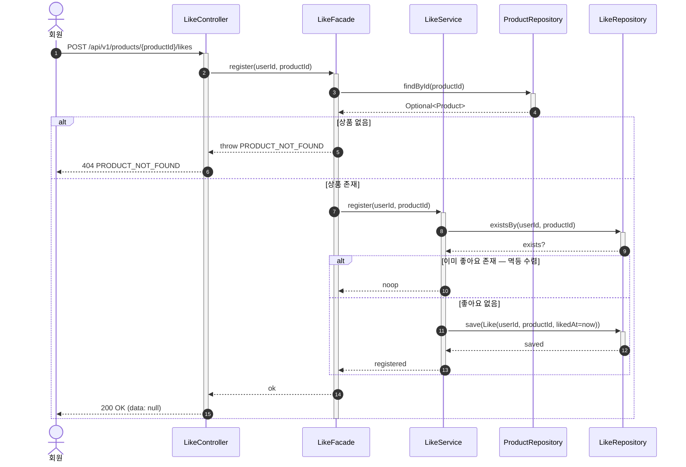
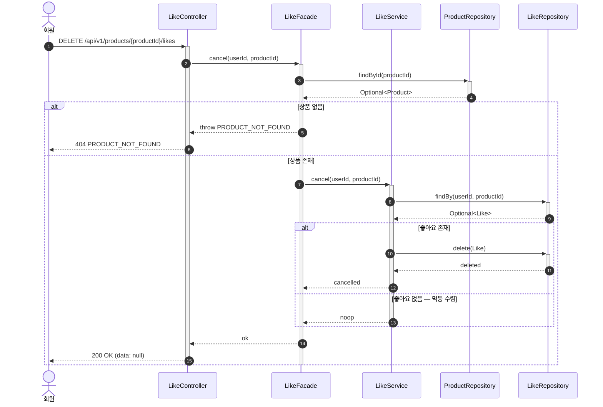
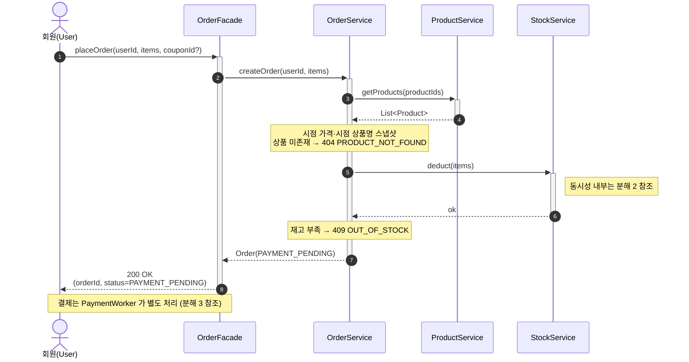
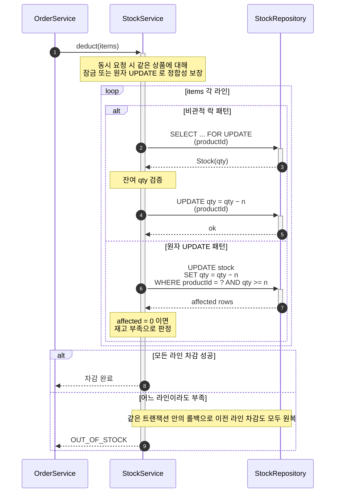
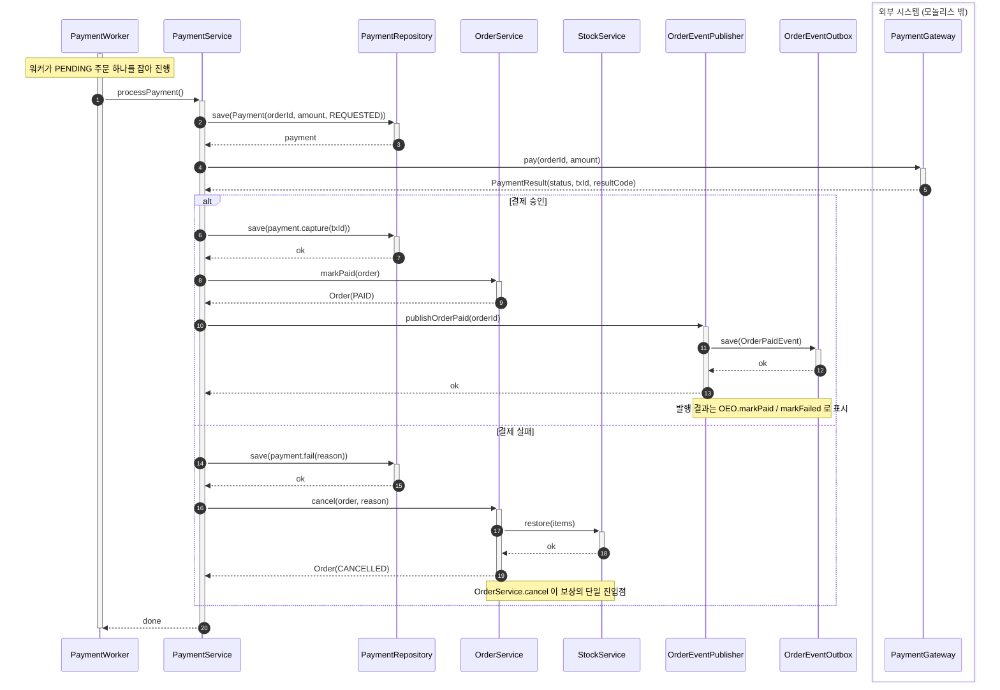

# 시퀀스 다이어그램

## 설계 의도

도메인별 유스케이스 흐름의 책임 분담과 협력 시점을 4계층(`interfaces → application → domain ← infrastructure`) 관점에서 가시화한다.

---

## 좋아요(Like) 도메인

> 좋아요 등록 / 좋아요 취소 흐름을 가시화한다.  
> 헤더 인증은 인증 필터(공통 사전 단계) 가 컨트롤러 진입 전에 통과시킨다 — 실패 시 `401 UNAUTHORIZED` 로 응답되고 Controller 에 닿지 않는다.

### 참여자

| 구분 | 참여자 | 위치 / 책임 |
|---|---|---|
| 액터 | `회원(User)` | HTTP 요청의 주체 |
| `interfaces.api` | `LikeController` | 응답 조립 |
| `application` | `LikeFacade` | `@Transactional` 경계, 외부 도메인 협력 조정 |
| `domain.like` | `LikeService` | 멱등 수렴 검사, 좋아요 도메인 규칙 |
| `domain.like` | `LikeRepository` | 영속화 인터페이스 |
| 다른 도메인 — `domain.product` | `ProductRepository` | 상품 존재 확인. 같은 모놀리스, 메서드 호출. |

### 좋아요 등록

> 상품 존재 확인 → 좋아요 존재 여부 검사 → 신규면 저장, 이미 존재하면 멱등 수렴.

### 좋아요 취소

> 상품 존재 확인 → 좋아요 조회 → 존재하면 제거, 없으면 멱등 수렴.

### 메모

- 트랜잭션 경계는 `LikeFacade` — 상품 존재 확인과 좋아요 변경이 같은 트랜잭션 안에서 일어난다.
- 멱등 수렴 검사는 `LikeService` 의 책임이다 (등록의 `existsBy`, 취소의 `findBy` 분기).
- 응답은 `data: null` — 토글 결과 상태(`liked` / `likeCount`) 는 본 도메인이 반환하지 않는다.

---

## 주문(Order) 도메인

> [03-class-diagram.md §2](./03-class-diagram.md) 의 비동기 결제 모델에 정합. 주문 생성은 동기로 `PENDING` 까지만 만들고 즉시 응답하고, 외부 결제는 `PaymentWorker` 가 폴링해 처리한다. 결제 처리의 끝에 outbox 이벤트가 기록되고, 별도 `OrderEventPublisher` 가 발행 책임을 진다.

### 참여자

| 구분 | 참여자 | 위치 / 책임 |
|---|---|---|
| 액터 | `회원(User)` | HTTP 요청의 주체 |
| `application` | `OrderFacade` | 동기 진입점. 주문 생성을 `PENDING` 까지 책임 |
| `application` (워커) | `PaymentWorker` | 비동기 결제 워커. 주기적으로 PENDING 결제 처리 |
| `application` (워커) | `OrderEventPublisher` | outbox 행 발행 책임 |
| `domain.order` | `OrderService` | 주문 상태 전이 + 보상의 단일 진입점(`cancel` 안에서 재고 원복) |
| `domain.order` | `OrderEventOutbox` | outbox 이벤트 행 관리 |
| `domain.payment` | `PaymentService` | 결제 처리 흐름 조정 |
| `domain.payment` | `PaymentRepository` | 결제 시도 행 누적 |
| 다른 도메인 — `domain.product` | `ProductService` | 상품 조회 |
| 다른 도메인 — `domain.stock` | `StockService` | 재고 차감 / 원복 |
| 외부 시스템 (모놀리스 밖) | `PaymentGateway` | 외부 결제 게이트웨이. 별도 프로세스 호출 |

### 1. 주문 생성 (동기, PENDING 까지)

> 회원의 `placeOrder` 요청에 대해 본 다이어그램은 PENDING 주문을 만들기까지만 책임진다. 결제는 비동기로 처리되므로 응답 시점에는 `status=PAYMENT_PENDING` 이다.

### 2. 재고 차감 (동시성)

> `domain.stock` 내부에서 동시 요청 시 정합성을 보장하는 방식. 라인 단위 실패는 같은 트랜잭션의 자동 롤백으로 흡수된다 — 결제 실패 시점의 명시적 보상(`restore`) 과는 다른 경로다.

### 3. 결제 처리 (비동기 워커)

> `PaymentWorker` 가 PENDING 주문을 잡아 `PaymentService` 로 결제 처리를 위임하고, 결과에 따라 주문 상태 전이 + outbox 이벤트 기록까지 끝낸다. 외부 결제 실패 시 `OrderService.cancel` 안에서 재고가 원복된다.

