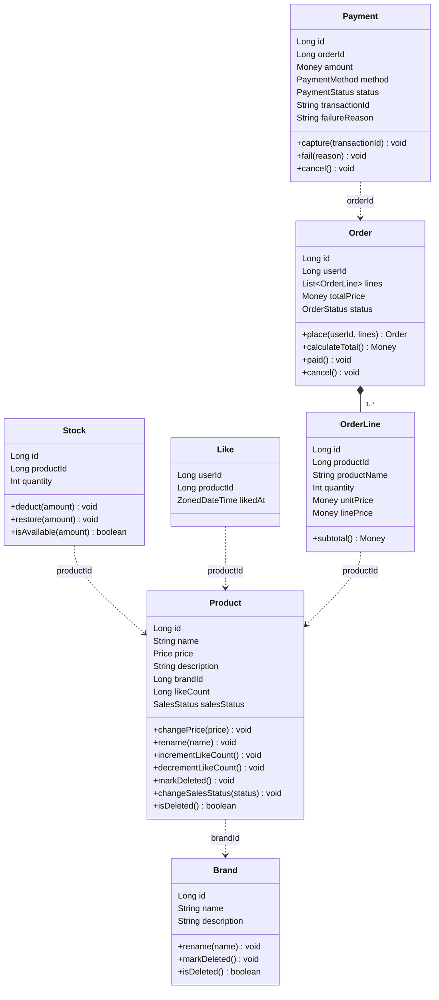
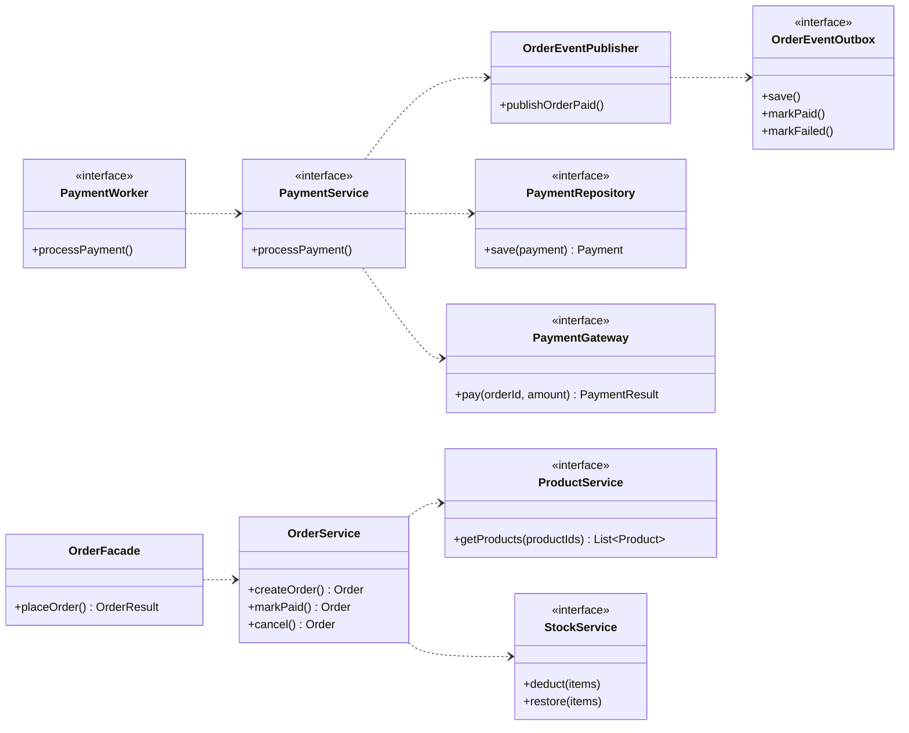

# 클래스 다이어그램

## 설계 의도

도메인 모델의 정적 구조와 4계층 구현 클래스의 의존을 두 시각으로 가시화한다. 본 문서는 "누가 무엇을 알고 있는가 — 의존의 방향과 책임의 경계" 를 다룬다.

- **도메인 모델** — 도메인의 엔티티 · VO · 관계. 도메인 간 약결합과 책임 분배를 점검한다.
- **컴포넌트 다이어그램** — UC-1 흐름의 4계층 정적 의존. 의존 역전과 협력 구분(본 도메인 / 다른 도메인 / 외부 시스템) 을 점검한다.

---

## 1. 도메인 모델
### 설계 원칙

| 원칙 |  적용 |
|---|---|
| **엔티티 / VO 분리** | 엔티티는 `id: Long` 과 변경 시점이 의미 있는 객체. VO 는 필드 타입으로만 등장하고 별도 박스로 그리지 않는다. 도메인 의미가 강한 것만 타입명(`Price`, `Money`) 으로 드러내고, 단순 wrapper 는 `String` / `Long` 으로 표기한다. |
| **단방향 기본** | 도메인 간 의존은 **모두 단방향**. 부모-자식 외에는 역참조가 없다. |
| **도메인 간 약결합** | 다른 도메인은 객체가 아닌 식별자로 참조한다. 다이어그램의 점선(`..>`) 이 이 약결합을 표시한다. |

### 도메인 클래스 다이어그램



> **VO 표기 규칙** — `Price`, `Money`, `SalesStatus`, `OrderStatus`, `PaymentMethod`, `PaymentStatus` 는 필드 타입으로만 등장한다. 도메인에 속한다는 의미는 타입명만으로 전달된다. 단순 wrapper 는 `String` / `Long` / `Int` 로 표기한다.

### 도메인별 책임

#### User

- **책임** — 본인 확인(`authenticate`), 비밀번호 변경(`changePassword`), 응답용 이름 마스킹(`maskedName`).
- **캡슐화** — 비밀번호 형식·해시 처리는 User 내부 책임. 외부 응답·로그에 노출되지 않는다.

#### Product / Brand

- **Product** — 가격·인기도(`likeCount`)·판매 상태 전이·삭제 마크.
  - 가격은 `Price` 타입으로 보유 (음수 불가 검증을 자료형 차원에서 보장).
  - 같은 브랜드 내 이름 유일성은 인스턴스 단일 책임 밖. 도메인 서비스 계층의 책임이다.
- **Brand** — 이름 변경, 삭제 마크.
  - 브랜드 삭제 시 소속 상품 카스케이드는 Facade 의 책임이다. Brand 가 `List<Product>` 를 들고 다니지 않는다.

#### Stock

- 1 상품 : 1 재고 행. `productId` 로만 Product 를 참조한다 (Product 가 Stock 을 들고 다니지 않는다).
- `deduct(amount)` / `restore(amount)` 가 도메인 책임. 부족 여부 판단은 `isAvailable(amount)` 가 가드한다.
- 동시 차감 경합은 인프라 계층의 비관적 락(`SELECT ... FOR UPDATE`) 으로 처리한다 — 도메인 객체는 락 정책을 모른다.

#### Like

- `(userId, productId)` 쌍이 비즈니스 키. `equals` / `hashCode` 가 이 키 기준으로 동작한다.
- `likedAt` 은 시각 정렬용으로만 쓰이며 응답에는 노출되지 않는다.
- 멱등 등록·취소 분기는 `LikeService` (본 다이어그램 밖) 의 책임이다.

#### Order / OrderItem

- **Order** — 항목 집계(`calculateTotal`), 상태 전이(`cancel`), 취소 가능성 판단(`isCancellable`).
  - `totalPrice` 는 스냅샷. 주문 후 상품 가격이 바뀌어도 변하지 않는다.
- **OrderItem** — 단일 상품 항목. 소계(`subtotal`) 만 책임진다.
  - 합산은 Order 의 책임이지 OrderItem 이 안 한다.
  - 주문 시점의 `productName` 과 `unitPrice` 를 스냅샷으로 보유. Product 가 사후에 개명·재가격되어도 주문 내역은 바뀌지 않는다.

#### Payment

- 한 결제 시도의 생명주기 — 요청 → 확정(`capture`) / 실패(`fail`) / 취소(`cancel`).
- 상태 전이는 자기 안에서 가드한다.
- `1 Order ↔ N Payment` — 재시도를 별 행으로 누적한다.
- `orderId` 만 보유한다. "누구의 결제인가" 는 `Order.userId` 를 통해 간접적으로 얻는다 (중복 보유 금지).
- `transactionId` 는 외부 결제사 거래 식별자 — `capture()` 시점에 채워지며 reconcile 의 단일 출처다.
- `failureReason` 은 실패 사유 스냅샷 — `fail(reason)` 시점에 기록된다.
- Order 의 상태를 직접 변경하지 않는다. Facade 가 Payment 의 상태 변화를 본 후 `Order.status` 를 동기화한다 (예: `Payment.CAPTURED` → `Order.PAID`).

### 도메인 경계와 의존 방향

```
User    ← (userId)    Like
User    ← (userId)    Order
Product ← (productId) Stock
Product ← (productId) Like
Product ← (productId) OrderItem
Brand   ← (brandId)   Product
Order   ← (orderId)   Payment
```

---

## 2. 컴포넌트 다이어그램

> [02-sequence-diagrams.md](./02-sequence-diagrams.md#주문order-도메인) 의 주문 도메인 시퀀스에서 실제 호출되는 메서드만 남기고 시그니처를 정렬했다. 시퀀스가 단일 트랜잭션 안에서 동기로 진행하므로 본 다이어그램의 진입점도 `OrderFacade.createOrder` 하나, 비동기 책임은 outbox 이벤트 발행 워커(`OrderEventPublisher`) 만이다.

### 다이어그램



### 컴포넌트별 책임

#### OrderFacade

- 회원의 주문 생성 요청 진입점이다.
- 회원/상품 조회, 주문 도메인 생성, 재고 차감을 하나의 DB 트랜잭션으로 처리한다.
- 외부 결제 호출은 같은 트랜잭션 안에서 수행하지 않는다.
- 주문은 `PAYMENT_PENDING` 상태로 저장한 뒤 즉시 응답한다.

#### OrderService

- 주문 도메인의 상태 전이 단일 진입점이다.
- 주문 생성 시 항목의 상품명·단가를 스냅샷으로 보유한다.
- `PAYMENT_PENDING → PAID / CANCELLED` 전이를 자기 안에서 가드한다.
- 주문 취소 시 재고 복구를 호출자 트랜잭션 안에서 한 책임으로 묶는다.

#### ProductService

- 주문 항목 검증용 상품 조회를 제공한다.
- 판매중(`SELLING`) 상태와 삭제 여부를 함께 검증한다.

#### StockService

- 상품 단위 재고를 차감/복원한다.
- 비관적 락으로 동시 차감 경합을 한 트랜잭션에 직렬화한다.
- 재고 부족 시 트랜잭션을 롤백시킨다.

#### PaymentWorker

- 결제 대기(`PAYMENT_PENDING`) 주문을 스케줄러로 폴링해 외부 PG 호출을 비동기 트리거한다.
- 주문 생성 시각으로부터 1분이 흘렀는지 여부를 애플리케이션 코드 안에서 직접 계산한다.
- worker 가 잠시 멈춰 있었거나 외부 응답이 늦어진 경우에도 누락 없이 만료를 잡도록 `PAYMENT_PENDING` 주문과 `REQUESTED` 결제를 함께 훑는다.
- 1분이 지난 건은 주문을 `PAYMENT_FAILED` 로 전이하고 결제 사유를 `TIMEOUT` 으로 마킹한다.

#### PaymentService

- 외부 결제 시스템에 요청하기 전에 결제를 `REQUESTED` 상태로 적재한다.
- `payment.orderId` 의 유니크 제약을 분산 락 대용으로 활용해 — 적재에 단 한 번 성공한 worker 만 실제 PG 호출로 진입시킨다.
- 이미 `CAPTURED` · `FAILED` · `CANCELLED` 로 종결된 결제는 만료 판정 대상에서 제외한다.
- 실패 · 취소 · 타임아웃 경로에서는 결제 결과 기록 → 주문 상태 전이 → 재고 원복을 한 트랜잭션에 묶어 부분 실패를 막는다.
- 결제 성공 시에는 데이터 플랫폼을 직접 호출하지 않고 주문 완료 이벤트의 적재를 `OrderEventPublisher` 에 위탁한다.

#### PaymentGateway

- 외부 결제 시스템의 추상 인터페이스다.

#### OrderEventPublisher

- 주문 완료 이벤트를 outbox에 저장한다.
- 호출자의 트랜잭션 경계와 정렬해 `Order.PAID` 전이와 이벤트 적재가 같은 커밋 안에서 일어나도록 보장한다.
- 외부 데이터 플랫폼으로의 실제 송신은 본인 책임이 아니다 — 발행은 별도 워커가 outbox 를 읽어 수행한다.

#### OrderEventOutbox

- 데이터 플랫폼으로 보낼 주문 이벤트의 영속 저장소 인터페이스다.
- 미발행 상태(`PENDING`) 의 이벤트를 시간순으로 조회하는 진입점을 노출한다.
- 발행 성공 시 행을 `PUBLISHED` 로 갱신하고, 실패 시 재시도 카운터를 올린다.
