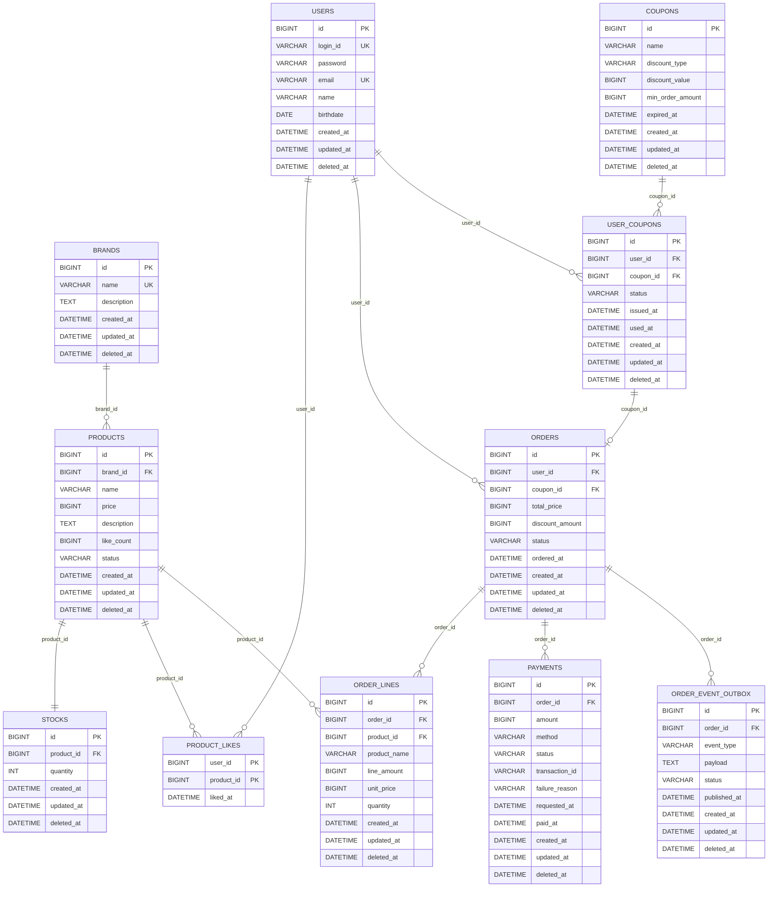

# ERD

## 설계 의도
상품, 브랜드, 좋아요, 주문, 결제, 재고의 영속성 구조와 관계를 정리한 ERD.   
soft delete 일관성, 도메인 간 약결합(ID 참조), 주문 시점 정보의 스냅샷 보존을 설계 축으로 둔다.

---

## 다이어그램

---

## 테이블 설명

### `users`
회원 정보를 저장한다. `login_id` 와 `email` 은 전체에서 유일하며, 비밀번호는 해시 형태로만 저장한다.

### `brands`
상품의 소속 브랜드를 저장한다. 이름은 활성 행에서 전체 유일하다.

### `products`
상품 카탈로그를 저장한다. 같은 브랜드 안에서 이름은 활성 행 한정 유일하며, `like_count` 는 좋아요 수의 캐시본이다.
- `status` : `SELLING` (판매중) / `STOPPED` (판매중지)

### `stocks`
상품 단위 재고를 저장한다.

### `product_likes`
회원의 상품 좋아요를 저장한다. `(user_id, product_id)` 복합 PK 로 (회원, 상품) 유일성을 강제하며, 본 테이블은 hard delete 를 사용한다.

### `orders`
주문 헤더를 저장한다. `total_price` 는 주문 시점 스냅샷이다.
- `status` : `PAYMENT_PENDING` (결제 대기) / `PAID` (결제 완료) / `CANCELLED` (취소)
- `coupon_id` : 주문에 적용한 **발급 쿠폰**(`user_coupons.id`) 을 가리키는 선택 FK. 쿠폰 미사용 주문은 `NULL`. 템플릿(`coupons`) 이 아니라 발급 인스턴스를 핀한다 — 한 주문은 최대 한 매의 발급 쿠폰을 소진한다(주문 1건당 1장).
- `discount_amount` : 쿠폰 적용으로 차감된 금액(원). 미사용이면 `0`. 최종 결제 대상 금액은 `total_price`(스냅샷 합계) 에서 본 값을 뺀 것이며 음수가 될 수 없다.

### `order_lines`
주문 항목을 저장한다. 주문 당시 상품명과 단가를 함께 저장해 상품 정보가 변경되어도 주문 내역이 변하지 않게 한다.

### `payments`
주문에 대한 결제 시도를 저장한다. 한 주문에 여러 시도(재시도·취소 등) 가 누적될 수 있으며, `transaction_id` 는 외부 결제사 거래 식별자다.
- `status` : `REQUESTED` (결제 요청) / `CAPTURED` (결제 완료) / `FAILED` (실패) / `CANCELLED` (취소)

### `order_event_outbox`
주문 도메인의 상태 변화 이벤트를 같은 트랜잭션으로 기록한다. 별도 워커가 `PENDING` 행을 읽어 재시도한다.
- `status` : `PENDING` (발행 대기) / `PUBLISHED` (발행 완료) / `FAILED` (발행 실패)

### `coupons`
관리자가 정의·관리하는 **쿠폰 템플릿(할인 정책)** 을 저장한다. 발급·사용 인스턴스는 `user_coupons` 가 별도로 보유한다(정규화 — 정의와 발급 분리).
- `discount_type` : `FIXED` (정액) / `RATE` (정률)
- `discount_value` : 정액이면 할인 금액(원), 정률이면 할인 비율(%). 양수. 정률은 1~100.
- `min_order_amount` : 적용 가능한 최소 주문 합계. 제약이 없으면 `NULL`.
- `expired_at` : 발급·사용이 더는 허용되지 않는 절대 시각.

### `user_coupons`
회원이 템플릿으로부터 **발급받아 소유하는 쿠폰 인스턴스** 를 저장한다. `(user_id, coupon_id)` 가 활성 행에서 유일해 **1인 1매** 를 강제한다.
- `status` : `AVAILABLE` (사용 가능) / `USED` (사용 완료) — 저장되는 값은 둘뿐이다.
- 만료(`EXPIRED`) 는 **저장하지 않는다** — 사용되지 않은 행의 `coupons.expired_at` 이 현재 시각을 지났을 때 **조회·사용 시 파생**되는 노출 상태다.
- `used_at` : 사용된 시각. 미사용이면 `NULL`. 사용 완료는 만료보다 우선한다(이미 사용된 쿠폰은 만료 시각을 지나도 `USED` 로 노출).
- 주문이 이 행을 소진하면 `orders.coupon_id` 가 이 행을 가리킨다(역방향 핀은 두지 않는다 — 단일 FK 로 표현).

---

## 외래 키 제약 동작 (ON DELETE)

대부분의 테이블은 soft delete 이므로 hard delete 는 정상 경로가 아니다. 아래 정책은 hard delete 가 일어났을 때의 fallback 으로, **보존을 우선**한다.

**RESTRICT — hard delete 차단**

- `products.brand_id → brands.id` &nbsp;&nbsp; 브랜드 hard delete 차단 (카스케이드 soft delete 가 정상 경로)
- `product_likes.user_id → users.id` &nbsp;&nbsp; 회원 hard delete 차단 (좋아요 이력 보존)
- `product_likes.product_id → products.id` &nbsp;&nbsp; 상품 hard delete 차단 (좋아요 행은 가려진 상품을 가리킨 채 유지)
- `orders.user_id → users.id` &nbsp;&nbsp; 회원 hard delete 차단 (주문 이력 보존)
- `order_lines.product_id → products.id` &nbsp;&nbsp; 상품 hard delete 차단 (상품 종료는 `status=STOPPED` 로 처리)
- `user_coupons.user_id → users.id` &nbsp;&nbsp; 회원 hard delete 차단 (발급·사용 이력 보존)
- `user_coupons.coupon_id → coupons.id` &nbsp;&nbsp; 템플릿 hard delete 차단 (발급 내역이 가리키는 템플릿 유지 — 템플릿 종료는 soft delete 로 처리)
- `orders.coupon_id → user_coupons.id` &nbsp;&nbsp; 발급 쿠폰 hard delete 차단 (어느 주문이 어느 쿠폰을 소진했는지 보존)

**CASCADE — 부모와 함께 정리**

- `stocks.product_id → products.id` &nbsp;&nbsp; 재고는 상품에 종속
- `order_lines.order_id → orders.id` &nbsp;&nbsp; 항목은 주문에 종속
- `payments.order_id → orders.id` &nbsp;&nbsp; 결제 시도는 주문에 종속 (audit 은 `deleted_at` soft delete 로 별도 보존)
- `order_event_outbox.order_id → orders.id` &nbsp;&nbsp; 미발행 이벤트는 보존 의무 없음

---

## Soft Delete 정책

**hard delete 를 쓰는 테이블**

- `product_likes` — 좋아요 취소는 행 자체를 제거한다. "삭제된 좋아요" 개념이 도메인에 없다.

**soft delete 를 쓰는 테이블** (그 외 모두)

- `deleted_at` 에 시각을 채워 논리 삭제로 처리한다.
- 조회 쿼리는 `WHERE deleted_at IS NULL` 을 기본 적용한다 — 회원 카탈로그, 관리자 목록, 주문/결제 이력 전부 동일.
- `order_event_outbox.deleted_at` 은 retention 마크용 — 발행 완료 행을 일정 기간 뒤 별도 정리 작업이 hard delete 한다.

**UNIQUE × soft delete**

- 활성 행(`deleted_at IS NULL`) 한정 유일 : `brands.name`, `(products.brand_id, products.name)`, `payments.transaction_id`, `user_coupons(user_id, coupon_id)`
- 복합 PK 가 그대로 유일성 보장 : `product_likes(user_id, product_id)` *(hard delete 이므로 활성 한정 처리 불필요)*

> `coupons` 는 관리자 삭제를 soft delete 로 처리한다(`brands` 와 동일). `user_coupons` 는 정상 경로에 삭제가 없고 상태(`AVAILABLE`/`USED`) 전이만 일어나므로 `deleted_at` 은 사실상 미사용이다 — 다만 `(user_id, coupon_id)` 유일성은 1인 1매를 위해 활성 행 한정으로 강제한다.

---

## 인덱스 정의

조회 패턴에 직결된 핵심 인덱스를 정의한다.

| 인덱스 | 테이블                  | 의도 |
|---|----------------------|---|
| **UNIQUE** `(login_id)`, `(email)` | `users`              | 가입 시점 유일성 강제. |
| **UNIQUE** `(name)` | `brands`             | 브랜드 이름 전체 유일(활성 행 한정). |
| **UNIQUE** `(brand_id, name)` | `products`           | 같은 브랜드 안 상품 이름 유일(활성 행 한정). |
| `(brand_id, created_at DESC)` | `products`           | 관리자 상품 목록 brand 필터 + 최신순. |
| `(sales_status, deleted_at)` | `products`           | 회원 카탈로그의 판매 가능 상품 필터링. |
| **UNIQUE** `(product_id)` | `stocks`             | 1 상품 : 1 재고 행. |
| *(복합 PK 자체)* `(user_id, product_id)` | `product_likes`      | (회원, 상품) 유일성 + 멱등 등록/취소 검사. 별도 UNIQUE 제약 불필요. |
| `(user_id, liked_at DESC)` | `product_likes`      | 내 좋아요 목록 정렬. |
| `(user_id, ordered_at DESC)` | `orders`             | 회원의 주문 이력 조회. |
| `(status, created_at)` | `orders`             | 만료/미결제 주문 스캔, 상태별 조회. |
| `(order_id)` | `order_lines`        | 주문 상세 조회(N+1 회피). |
| `(order_id, requested_at DESC)` | `payments`           | 주문의 결제 시도 누적 조회. |
| **UNIQUE** `(transaction_id)` | `payments`           | 외부 결제 거래 ID 유일성(비-NULL 행 한정). |
| `(status, created_at)` | `payments`           | 미확정 결제 모니터링. |
| `(status, created_at)` | `order_event_outbox` | PENDING 이벤트를 발행 워커가 시간 순서대로 스캔. |
| `(created_at DESC)` | `coupons`            | 관리자 쿠폰 템플릿 목록 최신순. |
| **UNIQUE** `(user_id, coupon_id)` | `user_coupons`       | 1인 1매 강제(활성 행 한정) + 동시 발급의 유니크 위반 흡수. |
| `(user_id, issued_at DESC)` | `user_coupons`       | 내 쿠폰 목록 발급 최신순. |
| `(coupon_id, issued_at DESC)` | `user_coupons`       | 특정 템플릿의 발급 내역 조회(관리자). |

---

## 데이터 정합성 전략

### 재고

- 주문 생성 시 상품 재고를 차감한다.
- 동시성 제어는 비관적 락(`SELECT ... FOR UPDATE`) 으로 처리한다.
- 재고 차감 시 `stocks` 행을 잠그고, 부족 여부를 확인한 뒤 차감한다 — 부족하면 주문 생성 트랜잭션을 롤백한다.
- 주문 취소·실패 시 차감분을 같은 트랜잭션 안에서 복원한다.

### 좋아요

- 좋아요 등록·취소는 **멱등 수렴** 한다 — 같은 요청을 N회 보내도 최종 상태와 응답이 동일하다.
- `(user_id, product_id)` 복합 PK 가 (회원, 상품) 유일성을 DB 차원에서 강제한다 — 동시 등록 시 발생하는 유니크 위반은 멱등 응답(`200 OK`) 으로 흡수한다.
- 상품의 `like_count` 캐시본은 좋아요 행 변경과 **같은 트랜잭션 안에서 증감** 한다 — 동시 증감 경합은 행 단위 락(또는 원자적 `UPDATE ... SET like_count = like_count ± 1`) 으로 처리한다.
- `like_count` 와 `product_likes` 행 집합의 정합성이 깨진 경우 별도 재집계 작업으로 회복한다.

### 주문 / 결제

- 주문 생성과 결제 시도는 **별도 트랜잭션** 이다 — 주문은 `status=PAYMENT_PENDING` 으로 시작한다.
- 결제 결과(`payments.status`) 변화를  관찰해 `orders.status` 를 동기화한다.
  - `Payment.CAPTURED` → `Order.PAID`
  - `Payment.CANCELLED` / `Payment.FAILED` → `Order.CANCELLED`
- 주문 상태 변화는 같은 트랜잭션 안에서 `order_event_outbox` 에 이벤트 행으로 함께 기록한다 — 상태 변경과 이벤트 발행의 누락을 막는다.
- 만료 주문(결제 대기 상태가 일정 시간 이상 지속) 은 배치가 스캔해 `CANCELLED` 로 전이하고 재고를 복원한다.

### 외부 시스템

- 외부 결제 응답은 `payments.transaction_id` 와 `payments.failure_reason` 두 컬럼에 기록한다 — 외부 거래 식별자가 단일 출처이며 `UNIQUE` 로 중복 매핑을 차단한다.
- 외부 결제 호출 직후 네트워크 단절·타임아웃으로 결과가 불확실한 경우, `transaction_id` 로 **조회(reconcile)** 해 상태를 정렬한다 — 임의 재시도로 이중 매입이 발생하지 않는다.
- 이벤트 발행은 **`order_event_outbox` 패턴** 으로 트랜잭션 안에서 이벤트를 기록하고, 별도 워커가 `PAYMENT_PENDING` 행을 읽어 발행 후 `PUBLISHED` 로 갱신한다 — 발행 중 실패는 `FAILED` 로 마크하고 재시도 큐로 회수한다.
- 외부 호출은 모두 타임아웃을 명시하며, 동일 요청 키(`transaction_id` / `event_id`) 로 멱등 처리한다.

### 쿠폰

- **정의/발급 분리**: `coupons`(템플릿) 와 `user_coupons`(발급 인스턴스) 를 분리해 정규화한다 — 할인 조건은 템플릿 한 곳에만 존재하고, 발급 쿠폰은 `coupon_id` 로 이를 참조한다(중복 컬럼 없음).
- **1인 1매**: `(user_id, coupon_id)` UNIQUE 가 (회원, 템플릿) 유일성을 DB 차원에서 강제한다 — 동시 발급 시 유니크 위반은 중복 발급 실패(`409`) 로 흡수한다.
- **단일 사용**: 발급 쿠폰은 `AVAILABLE → USED` 단방향 전이로 최대 한 번만 사용된다. 같은 발급 쿠폰에 대한 동시 사용 경합은 행 단위 락(`SELECT ... FOR UPDATE`) 또는 상태 조건부 갱신(`UPDATE ... SET status='USED' WHERE status='AVAILABLE'`) 으로 한 트랜잭션만 성공하도록 처리한다.
- **만료 파생**: 만료는 저장 상태가 아니라 `expired_at` 경과로 조회·사용 시 판정한다 — 별도 만료 배치에 의존하지 않으므로 상태 staleness 가 없다.
- **템플릿 삭제 무영향**: 템플릿 soft delete 는 이미 발급된 쿠폰의 조회·사용에 영향을 주지 않는다 — 발급 쿠폰의 템플릿 조회 경로는 삭제 마크를 무시하고 조회한다(발급 이력 보존).
- **주문 적용·보상**: 주문이 쿠폰을 적용하면 `orders.coupon_id` 로 발급 쿠폰을 핀하고 그 쿠폰을 `USED` 로 소진한다. 결제 실패 등으로 주문이 확정되지 못하면 같은 트랜잭션/보상 안에서 사용을 원복(`USED → AVAILABLE`) 한다 — 이 결선은 [order](../domain/order/requirements.md) 책임이며 본 모델은 그 슬롯(`coupon_id` · `used_at`) 만 제공한다.
