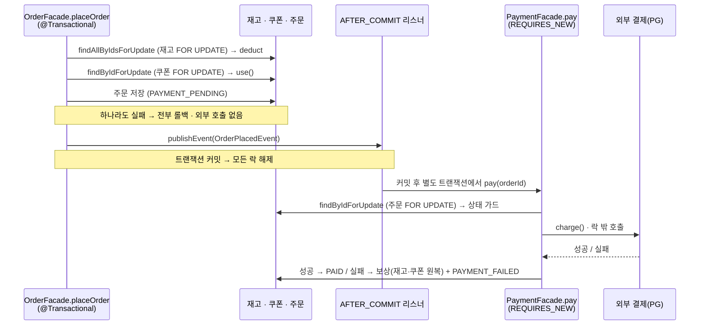

### TL;DR

좋아요·쿠폰·재고 세 자원의 동시 쓰기를 **한 가지 락으로 일괄 처리하지 않았다.** 결정의 1차 축은 *"이 쓰기가 현재 값을 보고 거절될 수 있는가"* 였다. 거절될 수 있는 불변식(재고 음수 불가, 쿠폰 재사용 불가)은 **비관적 락 + 도메인 메서드**로 직렬화하고, 거절이 없는 가환 카운터(좋아요 ±1)는 **원자 UPDATE**로 read-modify-write 자체를 없앴다. 비관/낙관을 한 애그리거트에 섞으면 생기는 부작용(특히 `@Version` 이 비관 락 경로까지 따라붙는 문제)을 피하려고 락 자원은 비관으로 통일했다. 마지막으로, 동시성 빈틈은 정방향 차감보다 **역방향(결제 실패 보상·재트리거)** 에 있었고, 정방향과 *같은 락·같은 순서*로 대칭을 맞췄다.

---

### 본문

## Introduction & Goals

#### Context / Background

세 가지 동시성 요구로 출발했다.

1. 같은 상품에 좋아요/취소가 동시에 몰려도, 좋아요 수가 정상 반영되어야 한다.
2. 같은 쿠폰으로 여러 기기에서 동시에 주문해도, 쿠폰은 단 한 번만 사용되어야 한다.
3. 같은 상품에 여러 주문이 동시에 요청되어도, 재고가 정상 차감되어야 한다.

셋 다 두 트랜잭션이 값을 `읽고 → 검증·계산하고 → 다시 쓰는` 사이에 서로의 변경을 못 본 채 옛값을 덮어쓰는 **lost update** 구조다. `@Transactional` 의 기본 격리 수준은 이를 막지 못한다.

| 자원 | read-modify-write 대상 | lost update 결과 |
|------|------------------------|------------------|
| 재고 | `stock` (n → n − 수량) | 둘 다 "충분" 판단 → 차감 덮어쓰기(초과 판매) |
| 쿠폰 | `status` (AVAILABLE → USED) | 둘 다 "사용 가능" 판단 → 중복 사용 |
| 좋아요 수 | `like_count` (n → n ± 1) | 한쪽 증감이 통째로 사라짐 |

결함 구조는 닮았지만 자원의 성격이 달라, 설계는 곧장 *도구 선택을 둘러싼 일련의 질문*으로 이어졌다. 이 문서는 그 질문과 결론을 그대로 기록한다.

- 세 자원에 락을 일괄 적용하면 되지 않나? → 성격이 달라 안 된다(아래 1차 축).
- **좋아요처럼 거절이 없는 카운터에까지 비관 락을 거는 건 오버엔지니어링 아닌가?** → 그렇다. 가환·무거절이라 원자 UPDATE 가 맞다.
- **쿠폰은 경합이 거의 없는데 낙관 락이 더 자연스럽지 않나?** → 자연스럽지만, 다른 이유로 비관을 택했다.
- **중복 결제 보상을 막으려고 `Order` 에 `@Version`(낙관)을 달면, 정작 `Order` 에 비관 락이 필요한 경로에 불필요한 낙관 락까지 따라붙지 않나?** → 그렇다. 그래서 결제/보상은 `@Version` 대신 주문 행 비관 락으로 풀었다.
- 다중 상품 주문에서 비관 락 조회에 정렬이 왜 필요한가? → 데드락 회피(락 획득 순서 고정).
- 동시 중복 좋아요/주문은 어떻게 흡수하나? → 유니크 제약으로 패자를 떨궈 "이미 처리됨"으로 수렴.

#### Goals

- 좋아요 수(`like_count`)가 실제 좋아요 행 수와 정확히 일치한다.
- 같은 쿠폰은 동시 사용에도 단 한 번만 소진된다.
- 같은 상품의 동시 주문에도 재고가 음수가 되거나 초과 판매되지 않는다.
- **결제 실패 보상·재트리거 같은 역방향 경로도 정방향과 동일한 동시성 보장을 받는다.**
- 자원 성격에 맞는 *최소한*의 도구를 쓴다 — 거절 없는 좋아요에 락을 끼얹지 않는다.
- 비관/낙관을 한 애그리거트에 섞지 않는다.
- 동시성 충돌은 500 이 아니라 의미 있는 도메인 에러(예: 409 `ALREADY_USED_COUPON`)로 표면화된다.

---

## Detailed Design

### System Architecture

#### 1차 축 — "이 쓰기가 거절될 수 있는가"

"비관이냐 낙관이냐" 보다 먼저 **"락이냐 원자 연산이냐"** 를 갈랐다.

| 이 쓰기가 현재 값을 보고 거절될 수 있는가? | 자원 | 결정 |
|---|---|---|
| **그렇다** (음수 재고·이미 쓴 쿠폰 거부) | 재고·쿠폰 | 락 안에서 현재 값을 읽어 **도메인이 거절을 판정** → 비관적 락 + 도메인 메서드 |
| **아니다** (좋아요는 누가 눌러도 ±1) | 좋아요 수 | 거절 판정이 없으니 락은 과함 → **원자 UPDATE** |

#### 트랜잭션 경계는 둘 — 외부 결제는 어떤 락도 쥐지 않는다

주문은 한 트랜잭션이 아니라 **두 트랜잭션**으로 쪼개진다. 주문 저장까지가 첫 트랜잭션, 외부 결제 호출은 커밋 이후 별도 트랜잭션이다. 비관 락을 *외부 응답 대기 동안 쥐고 있지 않기* 위함이다.



#### 재고 — 비관적 락 + id 정렬

`SELECT ... FOR UPDATE` 배타 락으로 동시 차감을 직렬화한다. `FOR UPDATE` 는 MVCC 스냅샷을 우회해 *락 획득 후 최신 커밋값*을 다시 읽으므로, 늦은 트랜잭션이 옛 재고를 보는 일이 사라진다. 거절은 도메인 `Stock.deduct`(`INSUFFICIENT_STOCK`) 가 판정한다.

다중 상품 주문은 여러 행을 잠그므로, A가 `상품1→2`·B가 `상품2→1` 로 잠그면 교착이다. **락 쿼리를 id 오름차순으로 고정**해 모든 트랜잭션이 같은 순서로 락을 얻게 했다 — 위 Context 의 "정렬이 왜 필요한가" 에 대한 답이다.

```kotlin
// ProductJpaRepository
@Lock(LockModeType.PESSIMISTIC_WRITE)
@Query("SELECT p FROM ProductEntity p WHERE p.id IN :ids ORDER BY p.id") // id ASC → 락 획득 순서 고정(데드락 회피)
fun findAllByIdInForUpdate(@Param("ids") ids: Collection<Long>): List<ProductEntity>
```

#### 쿠폰 — 비관적 락 (낙관이 더 자연스러운데도)

쿠폰은 `user_coupons` 행이 사용자별로 분리돼 hot row 가 아니고, 동시 사용은 한 사람이 여러 기기로 누르는 드문 경우뿐이라 경합이 거의 없다. 그래서 *"낙관 락이 더 자연스럽지 않나"* 라는 질문이 자연스럽게 나왔다. 그런데도 비관으로 통일한 이유는 정확성이 아니라 셋이다.

1. **비관/낙관을 한 애그리거트·한 트랜잭션에 섞지 않는다.** 주문 트랜잭션은 이미 재고를 비관 락으로 잡는다. 여기에 쿠폰만 낙관이면 fail-fast 흐름에 `OptimisticLockException` 처리가 끼어든다. 더 결정적으로, 결제 보상을 낙관(`@Version`)으로 풀려다가 깨달은 점 — **`@Version` 은 그 애그리거트의 *모든* 쓰기에 버전 검사를 강제**하므로, 정작 주문/쿠폰에 비관 락이 필요한 경로에 불필요한 낙관 검사까지 따라붙는다.
2. **에러 품질.** 비관이면 늦은 트랜잭션이 커밋된 `USED` 를 읽고 도메인 `use()` 가 `ALREADY_USED_COUPON`(409) 을 그대로 던진다. 낙관이면 인프라 예외를 도메인 에러로 번역하는 한 겹이 더 든다.
3. **점유가 짧다.** 외부 결제를 트랜잭션 밖으로 뺐기에 쿠폰 락 점유 구간이 짧다 — 낙관으로 락을 피해 얻는 이득이 거의 없다.

```kotlin
// UserCouponJpaRepository
@Lock(LockModeType.PESSIMISTIC_WRITE)
@Query("select uc from UserCouponEntity uc where uc.id = :id")
fun findByIdForUpdate(@Param("id") id: Long): UserCouponEntity?

// UserCoupon — 락으로 잡은 뒤, 상태 전이가 거절을 판정한다
fun use(at: LocalDateTime) {
    if (isUsed()) throw CoreException(CouponErrorType.ALREADY_USED_COUPON, "이미 사용된 쿠폰")
    if (at.isBefore(usableFrom) || at.isAfter(expiredAt)) throw CoreException(CouponErrorType.COUPON_NOT_APPLICABLE, "사용 가능 기간이 아님")
    status = UserCouponStatus.USED
    usedAt = at
}
```

#### 좋아요 — 락이 아니라 원자 UPDATE

*"좋아요 증감에 `increase()`/`decrease()` 같은 SQL 을 쓰면 도메인 객체를 못 거치는데, 그렇다고 비관 락을 거는 건 오버엔지니어링 아닌가?"* — 결론은 **원자 UPDATE 가 맞다** 였다. 좋아요 수는 거절 없는 가환 카운터라, 도메인 객체를 거쳐 검증할 불변식이 없다. 원자 증감 한 줄이 read-modify-write 윈도우 자체를 없애 lost update 를 막고, 핫 상품 직렬화 구간도 최소화한다.

```kotlin
// ProductJpaRepository
@Modifying(clearAutomatically = true)
@Query("UPDATE ProductEntity p SET p.likeCount = p.likeCount + 1 WHERE p.id = :id")
fun increaseLikeCount(@Param("id") id: Long): Int

@Modifying(clearAutomatically = true)
@Query("UPDATE ProductEntity p SET p.likeCount = p.likeCount - 1 WHERE p.id = :id AND p.likeCount > 0")
fun decreaseLikeCount(@Param("id") id: Long): Int
```

동시 중복 좋아요(같은 사용자)는 `(user_id, product_id)` 유니크 제약이 흡수한다 — 패자는 롤백돼 카운트는 정확히 +1 로 유지된다. *"동시 중복은 어떻게 흡수하나"* 에 대한 답이다.

**취소(`unlike`)의 멱등성에서 한 번 크게 막혔다.** *"같은 유저가 취소를 2번 보내도 예외 없이 멱등한가"* 를 테스트하다 발견한 실제 버그였다. 감소를 "실제로 행이 삭제됐을 때만" 하도록 게이트를 걸었는데, 동시성 테스트에서 같은 행에 감소가 여러 번 일어났다.

```kotlin
// LikeFacade.unlike — 실제 삭제가 일어난 트랜잭션만 카운트를 감소시킨다
val existing = likeRepository.findByUserIdAndProductId(userId, productId) ?: return
if (likeRepository.delete(existing) > 0) {
    productRepository.decreaseLikeCount(productId)
}
```

원인은 `deleteByUserIdAndProductId` 가 **파생(derived) delete** 라, Spring Data 가 "조회 후 제거"로 동작해 반환값이 *실제 삭제 행 수*가 아니라 *조회된 행 수*(동시 요청은 전부 1) 였던 것이다. 게이트가 전원 통과 → 과다 감소(5→0). 단일 `@Modifying` DELETE 로 바꿔 실제 affected-rows(패자는 0)를 반환하게 하고서야 닫혔다. (`@Modifying` 반환을 `Long` 으로 두면 0 으로 매핑되는 함정도 있어 `Int` 가 필요했다.)

```kotlin
// LikeJpaRepository
@Modifying(clearAutomatically = true)
@Query("DELETE FROM LikeEntity l WHERE l.userId = :userId AND l.productId = :productId")
fun deleteByUserIdAndProductId(@Param("userId") userId: Long, @Param("productId") productId: Long): Int
```

#### 정방향만 막아선 부족했다 — 역방향의 비대칭

이번 작업의 가장 큰 발견이다. 정방향(재고 차감·쿠폰 사용)을 비관 락으로 막고 나니, 그 **반대 방향**이 무방비였다.

- *"재고 복원을 원자 업데이트로 하면 정합성이 보장되나"* — 보상 시 재고를 메모리에서 읽어 더한 뒤 저장(read-modify-write)하면, 동시에 일어난 신규 차감을 덮어써 오히려 오버셀이 난다. → 정방향과 **똑같은** `findAllByIdsForUpdate`(id ASC)로 잡아 대칭을 맞췄다.
- *"`pay()` 가 동시·중복 트리거되면 이중 청구·이중 보상이 나지 않나"* — 주문을 무락 조회 + 상태 가드로만 처리하면 두 트리거가 동시에 PENDING 을 보고 둘 다 진행한다. → `findByIdForUpdate` 로 주문 행을 잡아 상태 전이(`PAYMENT_PENDING → PAID/FAILED`)를 원자화했다. 늦은 호출은 커밋된 비-PENDING 을 읽고 no-op.

```kotlin
// PaymentFacade
@Transactional(propagation = Propagation.REQUIRES_NEW)
fun pay(orderId: Long) {
    val order = orderRepository.findByIdForUpdate(orderId) ?: return  // 주문 행 비관 락 → 이중 청구/보상 방지
    if (order.status != OrderStatus.PAYMENT_PENDING) return           // 늦은 트리거는 no-op

    val result = paymentGateway.charge(order.id, order.totalAmount)   // 외부 호출 — 락 밖
    if (result.success) order.markPaid(result.transactionId, result.resultCode)
    else { compensate(order); order.markPaymentFailed(result.transactionId, result.resultCode) }
    orderRepository.save(order)
}

private fun compensate(order: Order) {
    // 보상 재고 복원은 신규 차감과 경합 → 차감과 동일한 비관 락(id ASC)으로 잡아 lost update 방지
    val products = productRepository.findAllByIdsForUpdate(order.lines.map { it.productId }).associateBy { it.id }
    order.lines.forEach { line -> products[line.productId]?.restoreStock(line.quantity.value) }
    productRepository.saveAll(products.values)
    order.userCouponId?.let { id ->
        userCouponRepository.findByIdForUpdate(id)?.let { it.cancelUse(); userCouponRepository.save(it) }
    }
}
```

데드락은 **모든 경로가 products 를 id 오름차순으로 잠그고, 주문 락은 단방향(order → products)** 이라 대기 사이클이 생기지 않는 것으로 닫았다. 정방향 차감과 역방향 복원이 *같은 락·같은 순서*를 공유하는 게 핵심이다.

### Data Models

동시성 관점에서 각 자원이 어떤 잠금/제약의 대상인지로 정리한다.

| 자원 | 통제 필드 | 동시성 도구 | 보호 제약 |
|------|-----------|-------------|-----------|
| `Product.stock` | `stock` (VO) | 비관적 쓰기 락(차감·복원 공통) | — |
| `Product.likeCount` | `like_count` | 원자 UPDATE(±1, 감소는 `> 0` 가드) | — |
| `Like` | 행 존재 | 원자 DELETE(affected-rows 게이팅) | `uk_likes_user_product (user_id, product_id)` |
| `UserCoupon` | `status` / `usedAt` | 비관적 쓰기 락(사용·취소 공통) | `(user_id, coupon_id)` |
| `Order` | `status` | 비관적 쓰기 락(결제·보상) | `uk_orders_user_idem (user_id, idempotency_key)` |

- `like_count` 는 `Like` 행 수의 **캐시**다. 정원(canonical)은 `Like` 테이블이고 카운터는 파생값이라, 원자 증감으로 따라가게 둔다.
- `Order.status` 흐름: `PAYMENT_PENDING → PAID | PAYMENT_FAILED`, 취소 시 `→ CANCELED`. 상태 전이가 곧 멱등 가드다(중복 콜백·재트리거 흡수).
- 결제는 주문의 `idempotencyKey` 를 재사용한다 — 별도 결제 멱등 키를 두지 않는다.

### API Design

동시성 제어는 **API 표면을 바꾸지 않는다.** 호출자는 락의 존재를 모른다. 다만 다음 계약이 동시성 위에서 성립한다.

- **주문 생성**: `idempotencyKey` 를 받아, 동일 키 재요청은 새 주문을 만들지 않고 기존 결과를 반환한다(`findByUserIdAndIdempotencyKey` 선조회 + `uk_orders_user_idem` 최후 방어선). 이것이 Context 의 *"unique 위반을 잡아 '이미 처리됨 → 기존 결과 반환' 으로 변환"* 의 구현이다.
- **쿠폰 충돌**: 이미 사용된 쿠폰으로 주문하면 `409 ALREADY_USED_COUPON` — 동시성 충돌이 500 으로 새지 않는다.
- **재고 부족**: `INSUFFICIENT_STOCK` (도메인 `Stock.deduct` 판정).
- **좋아요/취소**: 멱등하다. 같은 좋아요를 두 번 보내도 +1, 같은 취소를 두 번 보내도 −1 한 번만 반영된다.
- **결제**: 클라이언트가 트리거하지 않는다 — 주문 커밋 후 `AFTER_COMMIT` 리스너가 내부적으로 호출한다.

### Constraints

정합성은 지켰지만 다음 트레이드오프·전제가 있다.

1. **비관 락은 직렬화 비용을 낳는다.** 핫 상품·핫 쿠폰은 동시 처리가 줄을 선다. 정확성을 위한 의도된 비용이며, 좋아요를 락에서 빼 원자 UPDATE 로 돌린 것도 이 비용을 핫 카운터에 물리지 않기 위함이다.
2. **비관 락이 싼 것은 "락을 쥔 채 외부 응답을 기다리지 않는다"는 전제 위에서다.** 그래서 외부 결제는 반드시 `AFTER_COMMIT` + `REQUIRES_NEW` 로 트랜잭션·락 밖에서 호출한다. 이 경계가 무너지면 비관 락 점유가 PG 응답 시간만큼 길어진다.
3. **보상의 멱등성은 락이 아니라 상태 가드가 보장한다.** `compensate` 를 두 번 돌리면 두 번 복원된다. 이를 막는 것은 `pay` 의 주문 상태 전이(1회)이지 락이 아니다.
4. **`@Modifying` 의 함정 두 개.** ① 파생 `deleteBy` 는 affected-rows 가 아니라 조회 수를 반환해 동시성 게이팅을 무력화한다 → 단일 DELETE 문으로. ② 반환 타입을 `Long` 으로 두면 0 으로 매핑된다 → `Int`.
5. **테스트는 CPU 가 아니라 커넥션 풀에 묶인다.** 동시성 테스트 스레드를 늘리자 `Connection is not available` 가 났는데, 원인은 test 풀(10) + 결제 단계 `REQUIRES_NEW`(스레드당 2 커넥션)였다. 동시성 스펙에 한해 `maximum-pool-size` 를 키워 재현했다.

---

## Alternatives Considered

#### 재고

| 옵션 | Pros | Cons |
|------|------|------|
| A. 조건부 원자 UPDATE (`SET stock = stock - q WHERE stock >= q`) | 락 없이 한 번에 안전, 단순·빠름 | 차감이 SQL 한 줄에 갇혀 도메인 검증(`Stock.deduct`)을 메모리에서 못 함, 다중 라인 조율이 흩어짐 |
| B. 낙관적 락 + 재시도 | 대기 없음 | 인기 상품에서 충돌 폭증, 재시도 루프 비용 |
| **선택: C. 비관적 락(FOR UPDATE) + id ASC** | 잦은 충돌을 줄 세워 직렬화, 도메인 메서드로 차감/복원, 정·역방향 동일 도구 | 대기·락 점유 비용 |

#### 쿠폰

| 옵션 | Pros | Cons |
|------|------|------|
| A. 낙관적 락(`@Version` + `saveAndFlush`) | 저경합 자원에 대기 0, "한 명만 성공"이 자연스러움 | **`@Version` 이 애그리거트 전 쓰기에 버전 검사 강제** → 비관 락 경로와 충돌, 인프라 예외→도메인 에러 번역 한 겹, 코드베이스 일관성 깨짐 |
| **선택: B. 비관적 락(FOR UPDATE)** | 재고와 동일 모델로 통일, 깔끔한 `ALREADY_USED_COUPON`(409), 외부호출 분리로 점유 짧음 | 저경합인데도 매 사용마다 행을 잠금(다소 과함) |

#### 좋아요 수

| 옵션 | Pros | Cons |
|------|------|------|
| A. 비관적 락 + 도메인 객체 증감 | 도메인 메서드 경유 | 거절 없는 가환 연산에 과한 직렬화, 핫 상품 병목 (= 오버엔지니어링) |
| **선택: B. 원자 UPDATE (±1)** | read-modify-write 윈도우 제거, 직렬화 최소, 핫 카운터에 강함 | 도메인 객체 우회(가환·무거절이라 수용), 영속성 컨텍스트 staleness → `clearAutomatically = true` 로 처리 |

**선택 근거:**

세 선택을 관통하는 원칙은 **"자원이 거절을 판정해야 하는가"** 다. 재고·쿠폰은 현재 값을 보고 거절될 수 있는 불변식이라 *락 안에서 도메인이 판정*해야 하고(비관), 좋아요 수는 거절 없는 가환 카운터라 *판정 없이 원자 증감*이면 충분하다(락은 오버엔지니어링). 락으로 갈 자원 안에서 비관 vs 낙관은 2차 기준으로 갈랐는데, 결정타는 **`@Version`(낙관) 이 애그리거트의 모든 쓰기에 버전 검사를 강제해 비관 락 경로와 충돌**한다는 점이었다 — 결제 보상을 낙관으로 풀려다 마주친 문제다. 일관성·에러 품질까지 더해 락 자원은 전부 비관으로 통일했다.

---

### Cross-cutting Concerns

- **데드락 회피 (전역 규약).** 상품 행을 잠그는 모든 경로(정방향 차감·역방향 복원)는 **id 오름차순**으로 잠근다. 주문 락은 단방향(order → products)이라 락 대기 사이클이 생기지 않는다.
- **트랜잭션 전파.** 주문 저장은 기본 트랜잭션, 결제는 `AFTER_COMMIT` 리스너가 `REQUIRES_NEW` 로 별도 트랜잭션을 연다. 외부 호출이 주문 트랜잭션·락의 수명에 끼지 않게 하는 것이 목적이다.
- **멱등성 (세 층위, 서로 다른 도구).** 주문은 `idempotencyKey`(+ 유니크 제약), 좋아요는 `(user_id, product_id)` 유니크, 결제/보상은 주문 상태 전이로 멱등을 보장한다.
- **에러 변환.** 동시성 충돌이 인프라 예외(500)로 새지 않고, 비관 락 + 도메인 판정을 통해 의미 있는 도메인 에러(409 등)로 표면화된다.
- **테스트 인프라.** 동시성 스레드 수는 CPU 가 아니라 HikariCP 풀 크기에 묶인다. `REQUIRES_NEW` 단계가 스레드당 2 커넥션을 쥐는 점을 감안해 풀을 산정해야 한다.
- **향후 관측·복구.** 실제 PG 연동 시: 요청-전-영속 기반 reconcile/스윕(고아 PENDING·미정산 회수), 동시 취소 환불의 이중 호출을 막을 PG 멱등 키.

### Reference

- 주문 트랜잭션 경계: [`OrderFacade.placeOrder`](../../apps/commerce-api/src/main/kotlin/com/loopers/application/order/OrderFacade.kt)
- 결제·보상(역방향): [`PaymentFacade`](../../apps/commerce-api/src/main/kotlin/com/loopers/application/order/PaymentFacade.kt) · [`OrderPaymentEventListener`](../../apps/commerce-api/src/main/kotlin/com/loopers/application/order/OrderPaymentEventListener.kt)
- 재고 락·좋아요 카운터: [`ProductJpaRepository`](../../apps/commerce-api/src/main/kotlin/com/loopers/infrastructure/product/ProductJpaRepository.kt)
- 쿠폰 락: [`UserCouponJpaRepository`](../../apps/commerce-api/src/main/kotlin/com/loopers/infrastructure/coupon/UserCouponJpaRepository.kt) · [`UserCoupon`](../../apps/commerce-api/src/main/kotlin/com/loopers/domain/coupon/UserCoupon.kt)
- 좋아요 게이팅·delete: [`LikeFacade`](../../apps/commerce-api/src/main/kotlin/com/loopers/application/like/LikeFacade.kt) · [`LikeJpaRepository`](../../apps/commerce-api/src/main/kotlin/com/loopers/infrastructure/like/LikeJpaRepository.kt)
- 재고 도메인 규칙: [`Stock`](../../apps/commerce-api/src/main/kotlin/com/loopers/domain/product/Stock.kt)
- ERD: [`04-erd.md`](./04-erd.md)
